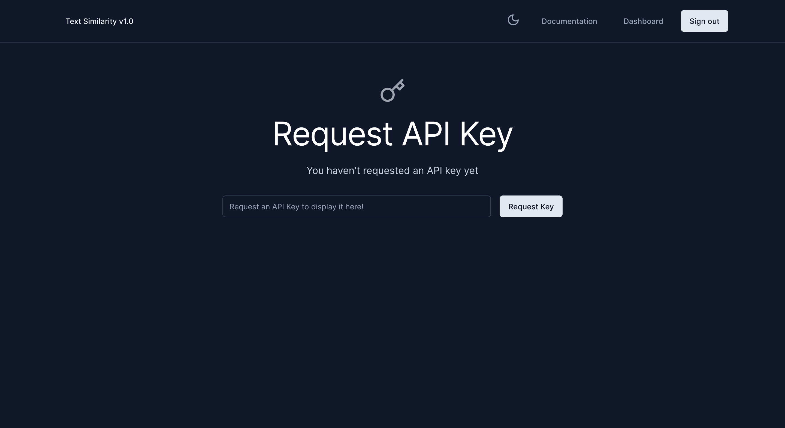
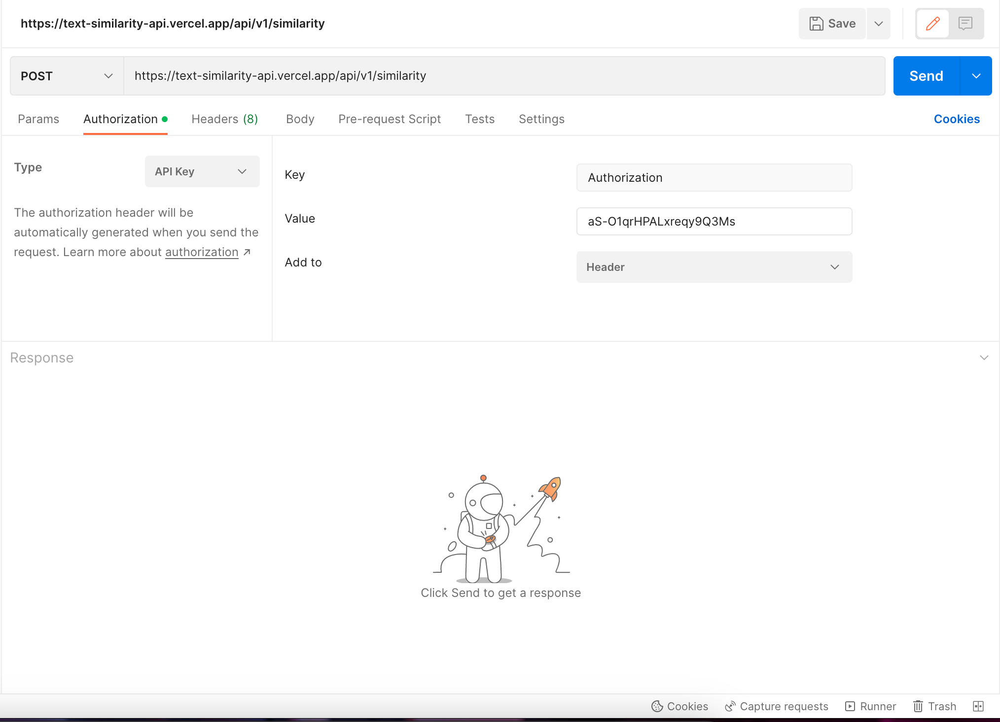
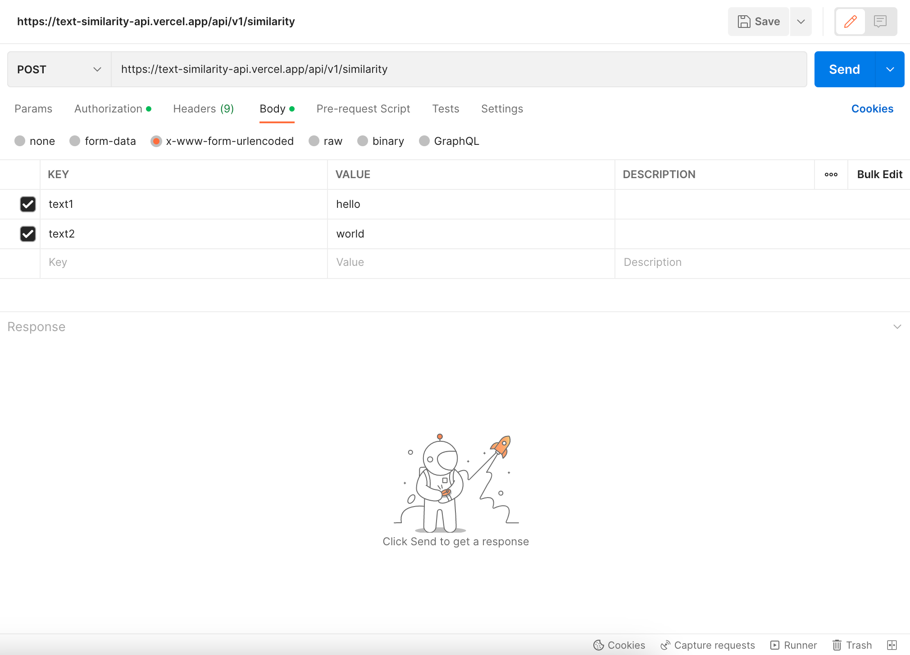
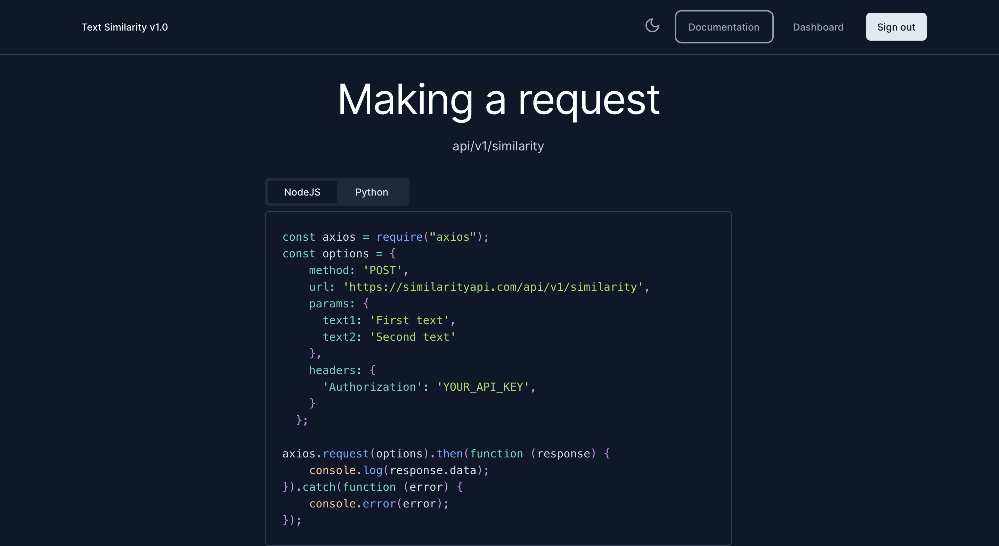

This is a [Next.js](https://nextjs.org/) project bootstrapped with [`create-next-app`](https://github.com/vercel/next.js/tree/canary/packages/create-next-app).

## Getting Started

First, run the development server:

```bash
yarn dev
```

Open [http://localhost:3000](http://localhost:3000) with your browser to see the result.

## Text Similarity API

A text similarity API is a tool that allows developers to compare two or more text documents and determine how similar they are. The API takes in one or more input texts and returns a similarity score or a ranking of the texts based on their similarity.

Based on the representation, the API can then calculate a similarity score between two or more texts. This score can be a numerical value between 0 and 1, where 0 means the texts are completely dissimilar, and 1 means they are identical.

Applications of text similarity APIs include plagiarism detection, content recommendation, document clustering, search result ranking, and more.

### How to Use the Application

-   When you open up the application on your browser, you have to sign in with a Google account
-   When you are successfully signed in, you will be redirected to the dashboard
-   In the dashboard, you will be able to click a button to generate a unique API Key
  
-   You can then go to Postman or any HTTP client of your choice and for the Authorisation option, you will select 'API Key' and in the Value textbox is where you will insert the API Key that was generated

-   Then in the body you can then include values for text1 and text2 which you will be using for the comparison

-   After that you should get a successful response with the value for the similarity test
-   After a successful run with the API, you can go back to the ``/dashboard`` page in the application to view a history of the requests you have made
-   If you want to use the API in an application, you can view the ``/documentation`` page on the application for guidelines written in python and Node.Js


`` Please note that you can only make 5 requests per hour ``
